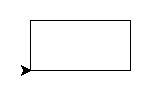
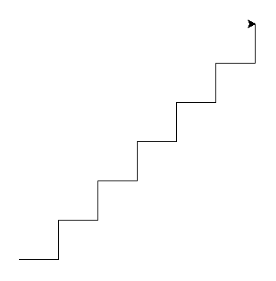

# 🐍 🐢

V této lekci si vyzkoušíš *želví kreslení*.

Spusť&nbsp; Python v *interaktivním módu* (bez souboru .py).

```pycon
$ python

>>>
```

> [note]
> (Znaky `>` a `$` píše počítač, ne ty.
> Na Windows bude místo `$` znak
> `>` a před `$` nebo
> `>` může být ještě něco dalšího.)

Pak napiš:

```python
from turtle import forward

forward(50)
```

Ukáže se okýnko se šipkou, které nezavírej.
Dej ho tak, abys viděla i příkazovou řádku
i nové okýnko.

## A kde je ta želva?

Želva je zrovna převlečená za šipku.
Ale funkce `shape` ji umí odmaskovat:

```python
from turtle import shape

shape('turtle')
```

Modul `turtle` obsahuje spoustu dalších funkcí, kterými můžeš želvu ovládat.
Pojďme se na ně kouknout zblízka.


## Otáčení

Želva se umí otáčet (doleva – `left` a doprava – `right`) a lézt po papíře
(dopředu – `forward`).
Na ocase má připevněný štětec, kterým při pohybu kreslí čáru.

```python
from turtle import forward, left, right

forward(50)
left(60)
forward(50)
right(60)
forward(50)
```

Zkus chvíli dávat želvě příkazy.
Když se ti výsledek nelíbí, můžeš zavřít kreslící okno a zkusit to znovu.
(Nebo místo zavření okna můžeš naimportovat a použít funkci `clear()`.)

Pokud je pro tebe těžké představit si kam se želva pomocí `left` a `right` otáčí 
můžeš zkusit používat funkci `setheading`, které předáš absolutní úhel vůči "papíru":
0° je doprava, 90° nahoru, 180° doleva, 270° dolu.  


## Želví program

Interaktivní mód je skvělý na hraní,
ale teď přejdeme zase na soubory.

Vytvoř si v editoru nový soubor.
Ulož ho do adresáře pro dnešní lekci pod jménem `zelva.py`.

> [note]
> Jestli adresář pro dnešní lekci ještě nemáš, vytvoř si ho!
> Pojmenuj ho třeba `02`.

> [warning]
> Soubor nepojmenovávej `turtle.py` – z modulu `turtle` budeš importovat.

Jestli chceš pro soubor použít jiné jméno, můžeš, ale
nepojmenovávej ho `turtle.py`.

Do souboru napiš příkazy na nakreslení obrázku
a – pozor! – na konci programu zavolej funkci `exitonclick`
(naimportovanou z modulu `turtle`).

> [note] Otázka
> Co dělá funkce <code>exitonclick</code>, kterou voláš na konci programu?

## Přerušovaná čára

Funkce `penup` řekne želvě, aby zvedla ocásek se štětcem: bude se tak hýbat
aniž by za sebou nechávala stopu.
Funkcí `pendown` můžeš želvě říct, aby kreslit zase začala.
Zkus si to:

```python
from turtle import forward, penup, pendown, exitonclick

forward(30)
penup()         # od teď želva nekreslí
forward(5)
pendown()       # od teď želva zase kreslí
forward(30)

exitonclick()
```

Až to budeš mít hotové, zkus začít kreslit trochu složitější obrázky:

### Čtverec

Nakresli čtverec.


Čtverec má čtyři rovné strany
a čtyři rohy po 90°.


```python
from turtle import forward, left, exitonclick

forward(50)
left(90)
forward(50)
left(90)
forward(50)
left(90)
forward(50)
left(90)

exitonclick()
```


### Obdélník

Nakresli obdélník.

Zkus zařídit, aby se po nakreslení „dívala” želva doprava (tak jako na začátku).




```python
from turtle import forward, left, exitonclick

forward(100)
left(90)
forward(50)
left(90)
forward(100)
left(90)
forward(50)
left(90)

exitonclick()
```


### Tři čtverce

Nakresli tři čtverce, každý otočený třeba o 20°.



```python
from turtle import forward, left, exitonclick

forward(50)
left(90)
forward(50)
left(90)
forward(50)
left(90)
forward(50)
left(90)

left(20)

forward(50)
left(90)
forward(50)
left(90)
forward(50)
left(90)
forward(50)
left(90)

left(20)

forward(50)
left(90)
forward(50)
left(90)
forward(50)
left(90)
forward(50)
left(90)

exitonclick()
```


Tolik kódu! Tohle musí jít nějak zjednodušit!

Jde.
Přesně proto jsme se učili `for` cyklus!


## Dlouhá přerušovaná čára

Už víš, že pomocí `penup` a `pendown` lze nakreslit přerušenou čáru:

```python
from turtle import forward, penup, pendown, exitonclick

forward(30)
penup()         # od teď želva nekreslí
forward(5)
pendown()       # od teď želva zase kreslí
forward(30)

exitonclick()
```

Zkus nakreslit dlouhou přerušovanou čáru.



```python
from turtle import forward, penup, pendown, exitonclick

for i in range(10):
    forward(10)
    penup()
    forward(5)
    pendown()

exitonclick()
```



Pak zkus zařídit, aby jednotlivé čárky byly postupně
větší a větší.


> [note] Nápověda
>
> První čárka je dlouhá 1 jednotku, druhá 2 jednotky, třetí 3, atd.
>
> Dokonce můžeš na začátek dát prázdnou čárku (0 jednotek)
> a mít tak délky 0, 1, 2, 3, 4, …
>
> V jaké proměnné máš při prvním průchodu cyklem 0, ve druhém 1, atd.?


```python
from turtle import forward, penup, pendown, left, exitonclick

for i in range(20):
    forward(i)
    penup()
    forward(5)
    pendown()

exitonclick()
```



## Čtverec II

A teď znovu nakresli čtverec, tentokrát lépe – s použitím cyklu!

Čtverec se kreslí následovně:

* Čtyřikrát:
  * Popojdi dopředu (a kresli přitom čáru)
  * Otoč se o 90°



```python
from turtle import forward, left, exitonclick

for i in range(4):
    forward(50)
    left(90)

exitonclick()
```


### Tři čtverce

Nakonec nakresli 3 čtverce, každý otočený o 20°.
Tentokrát už víš, jak to dělat chytře: opakuj pomocí příkazu
`for`, ne kopírováním kódu.


* Třikrát:
  * Nakresli čtverec (viz jedna z předchozích úloh)
  * Otoč se o 20°


```python
from turtle import forward, left, right, speed, exitonclick

# Třikrát:
for i in range(3):

    # Nakresli čtverec (kód zkopírovaný z předchozí úlohy a odsazený)
    for j in range(4):
        forward(50)
        left(90)

    # Otoč se o 20°
    left(20)

exitonclick()
```



## Úkol navíc

Máš-li hotovo, zkus nakreslit schody:



A máš-li i schody, zkus nakreslit těchto šest (nebo sedm?) šestiúhelníků:


